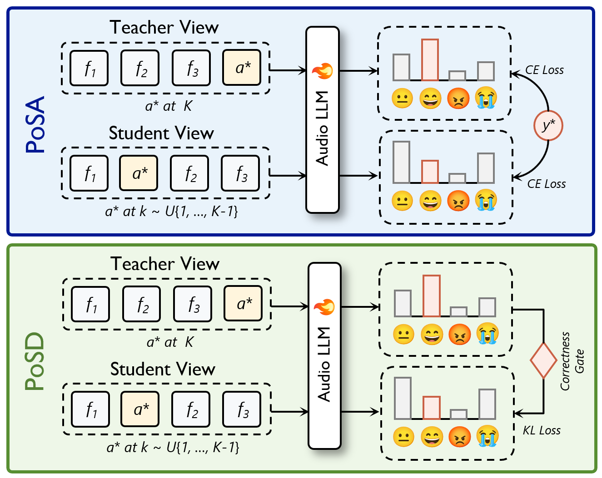

# Position-Shuffled Augmentation (PoSA) and Position Self-Distillation (PoSD) for Multi-Turn Speech Emotion Tracking

This repository contains the core implementation of **Position-Shuffled
Augmentation (PoSA)** and **Position Self-Distillation (PoSD)** from *Do Audio
LLMs Remember Your Emotion? Diagnosing and Repairing Missing Positional
Awareness in Multi-Turn Speech Emotion Tracking*.

## Method

PoSA-PoSD is a position-robust training framework for multi-turn speech emotion
tracking. It addresses the difficulty Audio LLMs face in locating and
recognizing emotions at non-final turns despite their strong single-utterance
emotion recognition ability. PoSA exposes the same target utterance at
different sequence positions to establish reliable turn-content binding, while
PoSD transfers the model's reliable final-position knowledge to earlier
positions, improving the consistency and robustness of emotion prediction
across turns.

<p align="center">
  
</p>

## Installation

Python 3.10 or newer is recommended.

```bash
python -m venv .venv
source .venv/bin/activate
pip install -r requirements.txt
```

Download Qwen2-Audio separately and follow its license and usage conditions.

## Data format

Prepare a CSV manifest with the following columns:

```csv
path,emotion,dialogue_id,dataset
audio/example_001.wav,anger,dialogue_001,my_dataset
```

`path` may be absolute or relative to the manifest. `dialogue_id` is used to
avoid drawing a filler from the same dialogue as the target.

The example manifest contains placeholder paths only. Audio files and datasets
must be obtained separately.

## Generate PoSA pairs

```bash
python -m emotrack.posa \
  --manifest /path/to/train.csv \
  --output artifacts/train_posa.jsonl \
  --num-samples 8400 \
  --turns 4 \
  --seed 42
```

Each JSONL group contains a target-final `teacher` record followed by a paired
target-earlier `student` record. To inspect the schema without using real data,
see `examples/paired_views.example.jsonl`.

## Train

PoSA only:

```bash
python train_qwen2audio.py \
  --model /path/to/Qwen2-Audio-7B-Instruct \
  --train-jsonl artifacts/train_posa.jsonl \
  --output-dir runs/posa \
  --posd-weight 0
```

PoSA + PoSD:

```bash
python train_qwen2audio.py \
  --model /path/to/Qwen2-Audio-7B-Instruct \
  --train-jsonl artifacts/train_posa.jsonl \
  --output-dir runs/posa_posd \
  --posd-weight 1
```

The convenience script runs either configuration:

```bash
MODEL_PATH=/path/to/model MANIFEST=/path/to/train.csv \
  bash scripts/train.sh posa

MODEL_PATH=/path/to/model MANIFEST=/path/to/train.csv \
  bash scripts/train.sh posa_posd
```

## Citation

Please cite the paper if this implementation is useful. The final BibTeX entry
will be added after publication.

## License

The code in this repository is released under the MIT License. Models and
datasets retain their original licenses.
